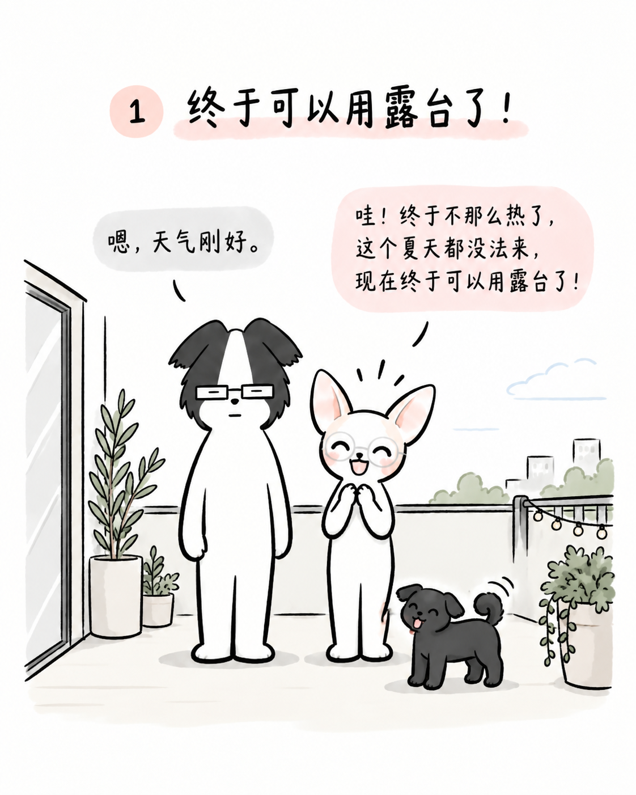
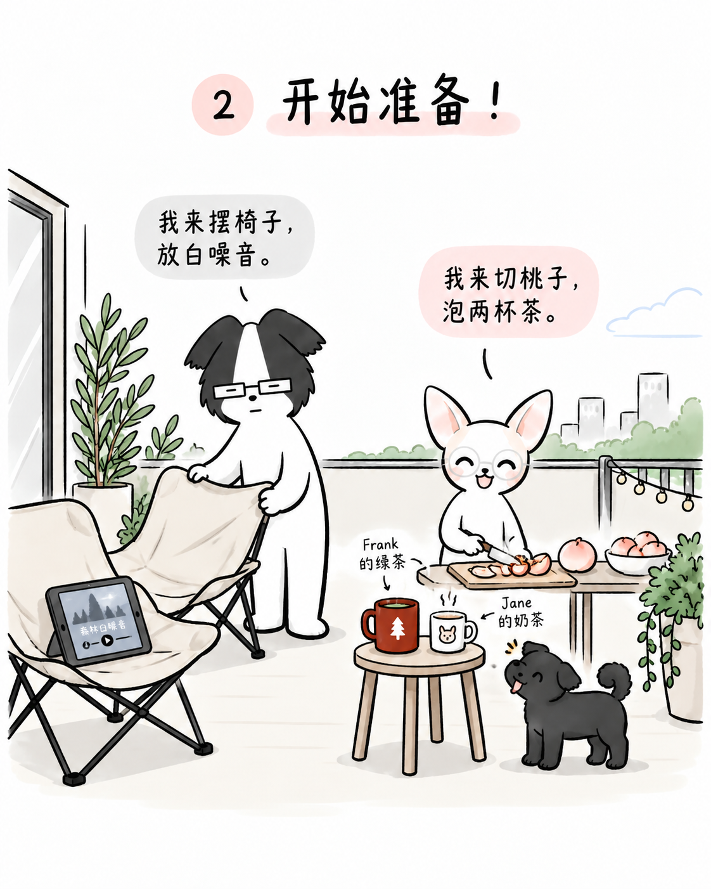
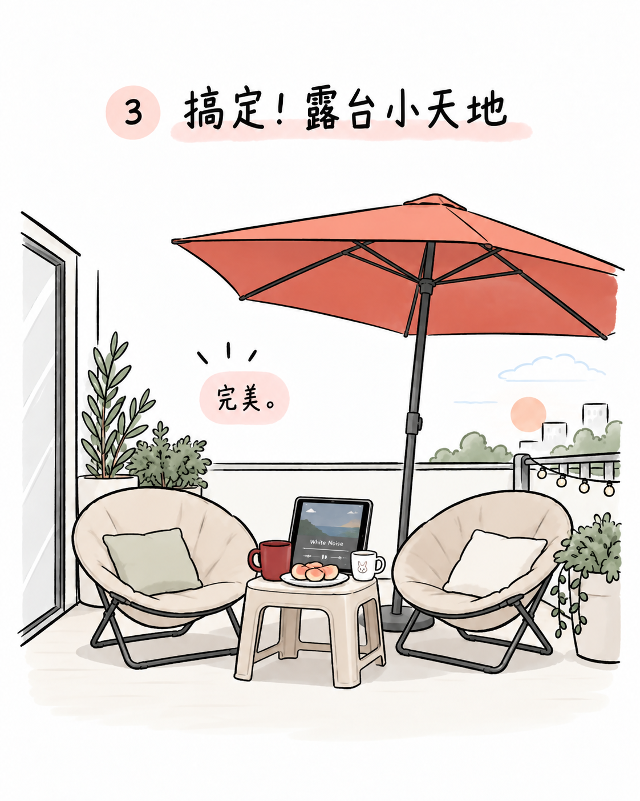
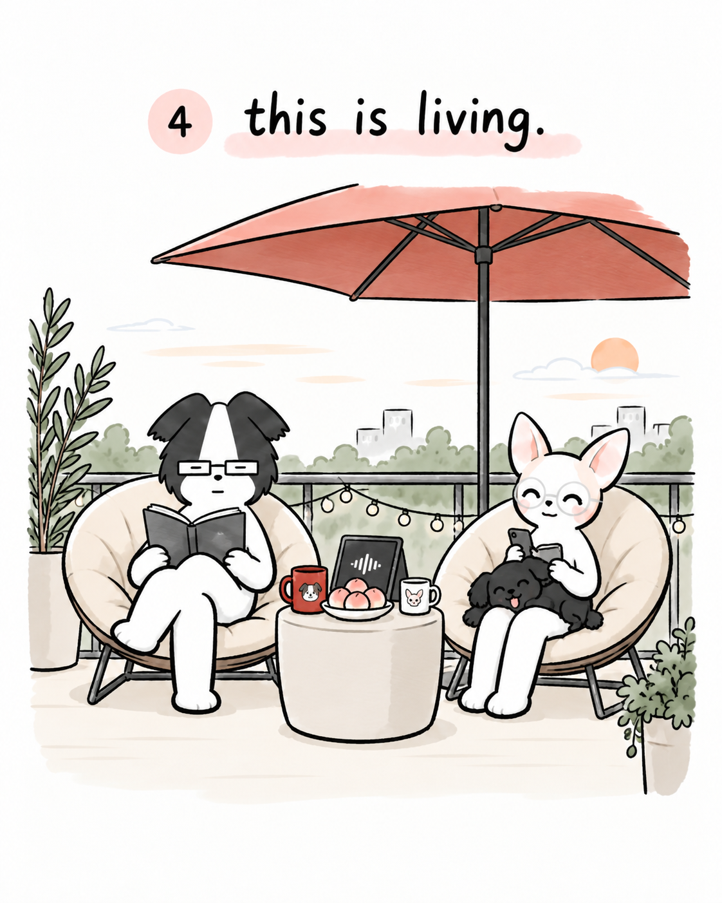
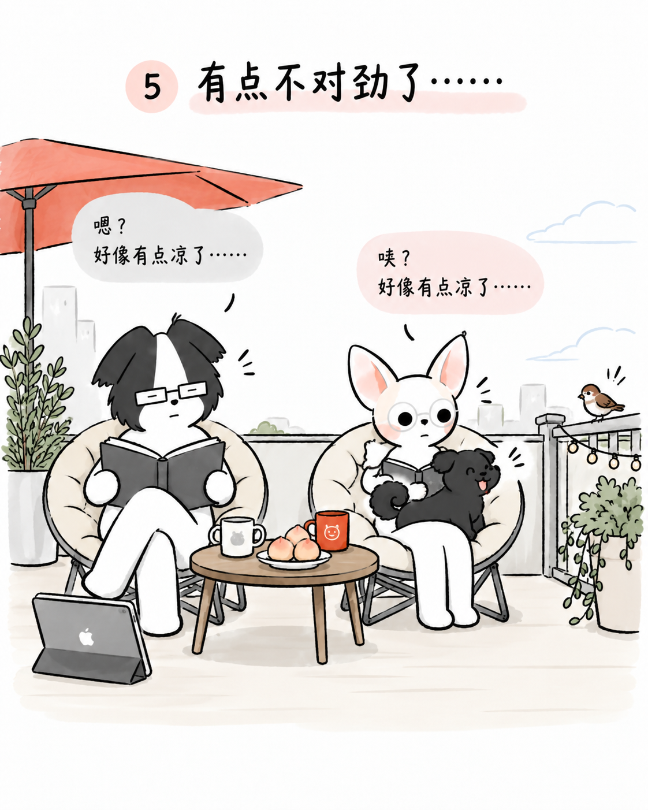
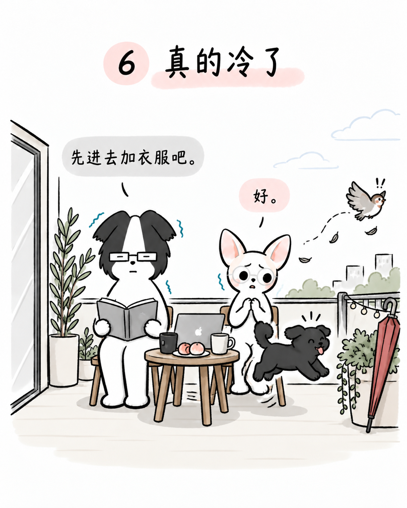
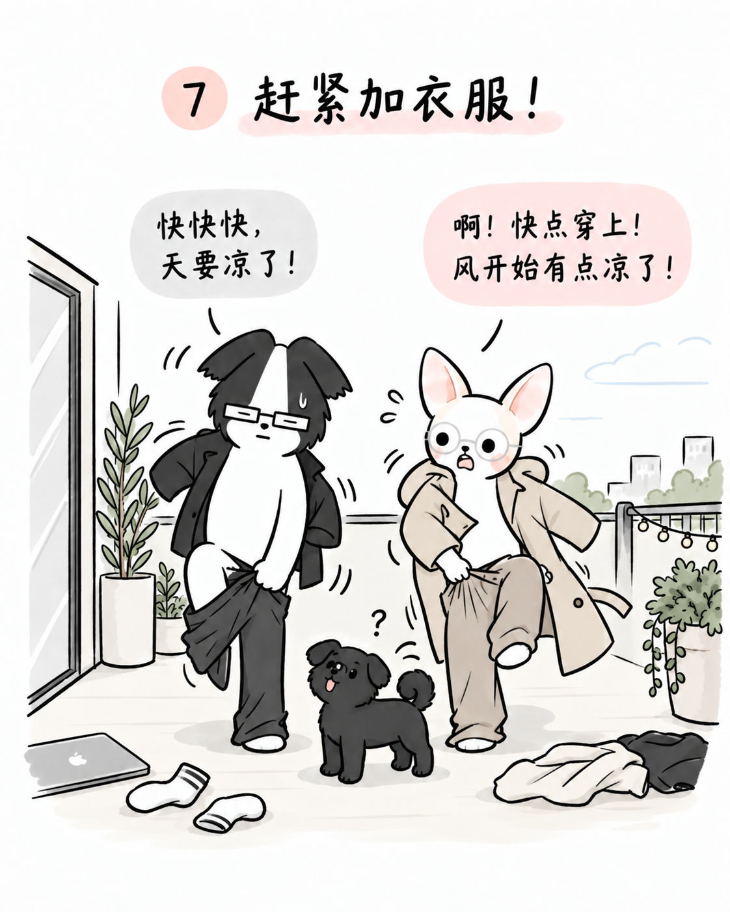
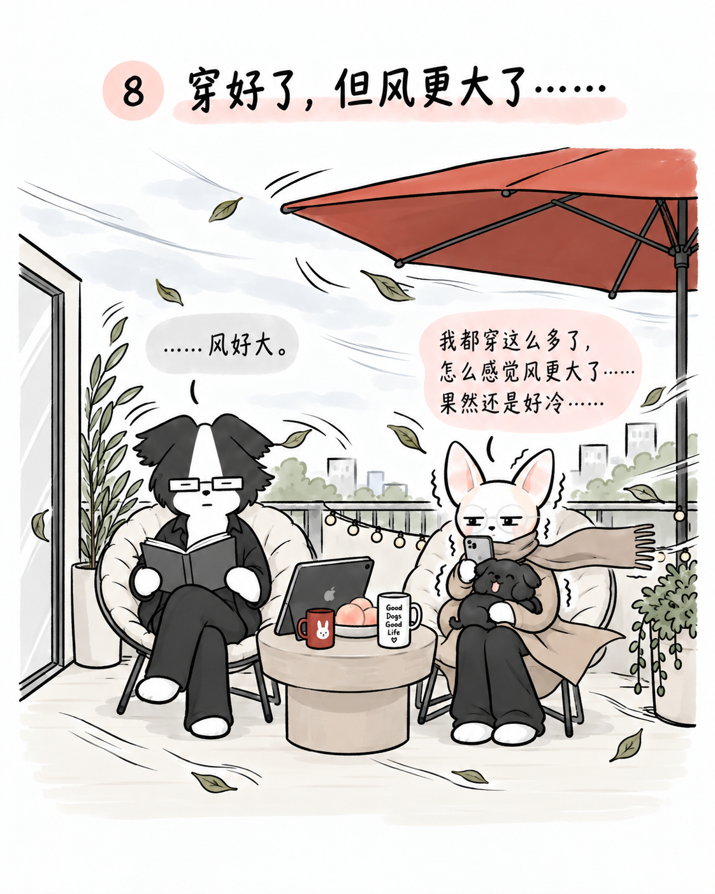
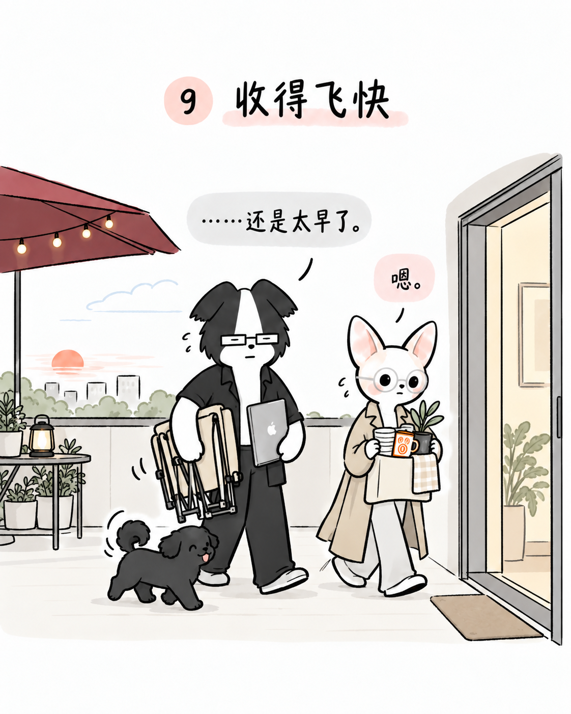

# Autumn Terrace · 秋日露台

**Artwork by Jane Wang. Copyright © 2026 jane-wang-art. All rights reserved.**  
Original source: [jane-wang-art/jane-frank-artwork](https://github.com/jane-wang-art/jane-frank-artwork)

Nine separate pages in reading order. Each image below links to its unchanged original PNG. [Back to the gallery](../../README.md).

## 01 · 终于可以用露台了

## 02 · 开始准备

## 03 · 露台小天地

## 04 · this is living.

## 05 · 有点不对劲

## 06 · 真的冷了

## 07 · 赶紧加衣服

## 08 · 风更大了

## 09 · 收得飞快

---

Artwork by **Jane Wang**. Copyright © 2026 **jane-wang-art**. Source: [this repository](https://github.com/jane-wang-art/jane-frank-artwork).

The files are publicly viewable, not freely licensed. Authorized reuse requires paid written permission and audience-visible attribution, subject to the [license](../../LICENSE.md). See [attribution wording](../../ATTRIBUTION.md).

## File integrity

All nine original PNGs are 1122 × 1402 pixels. This upload did not redraw, resize or add watermarks to them. [Metadata](metadata.json), [source/version record](SOURCES.md), and [SHA-256 checksums](SHA256SUMS.txt) are retained alongside the episode.

From this directory, a local copy can be checked using `sha256sum -c SHA256SUMS.txt`. These checks verify file integrity, not copyright registration or original creation dates.
